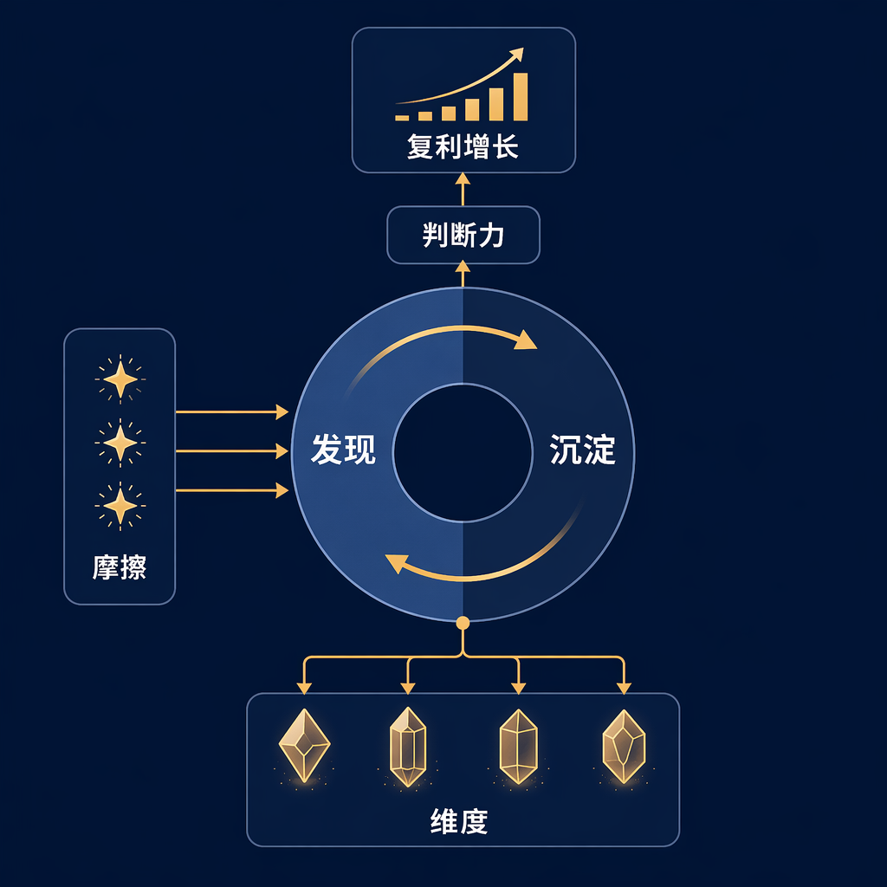
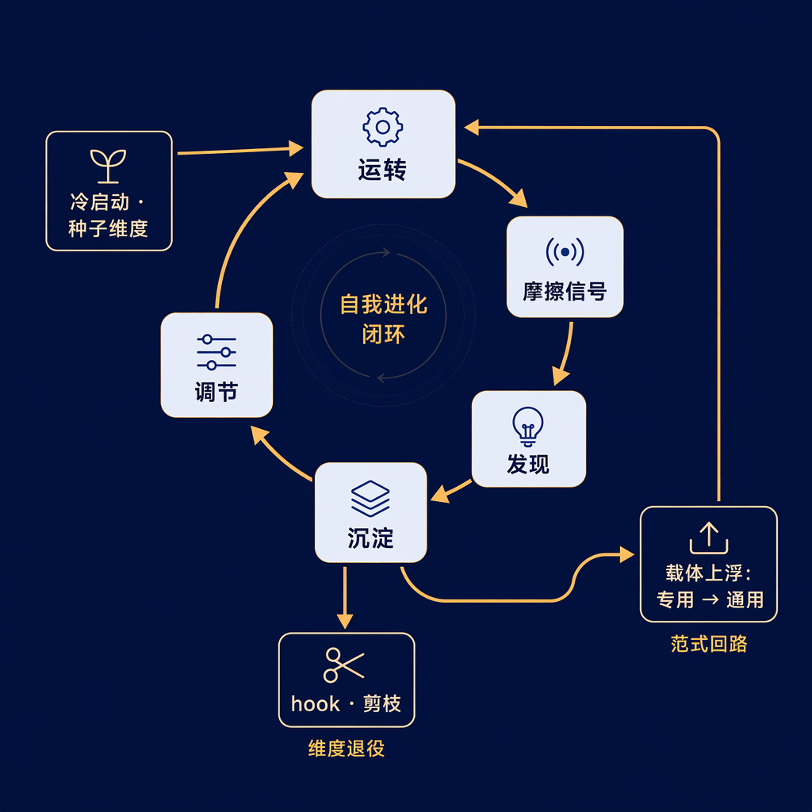
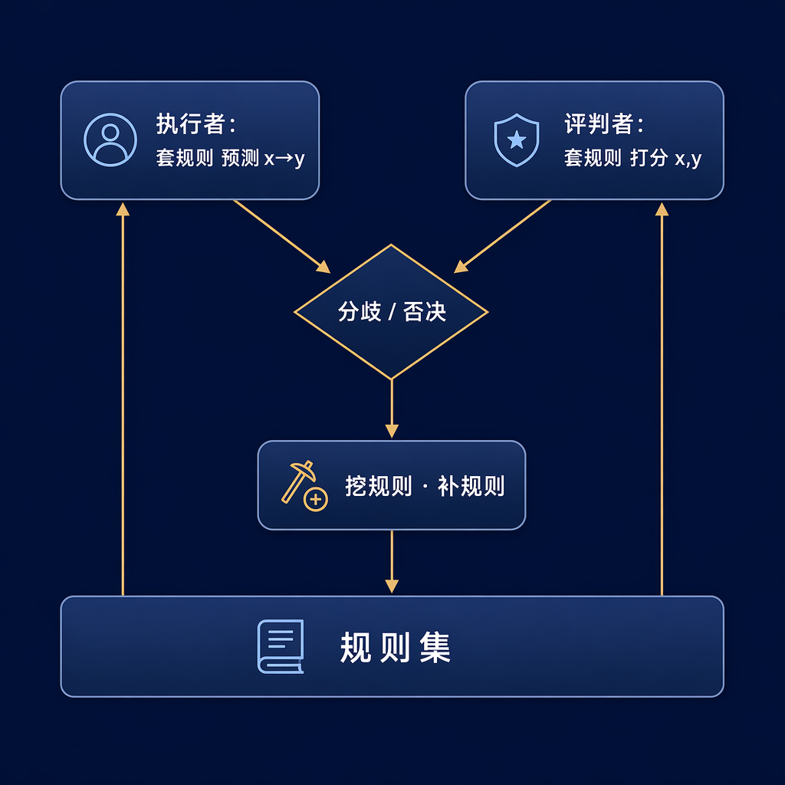
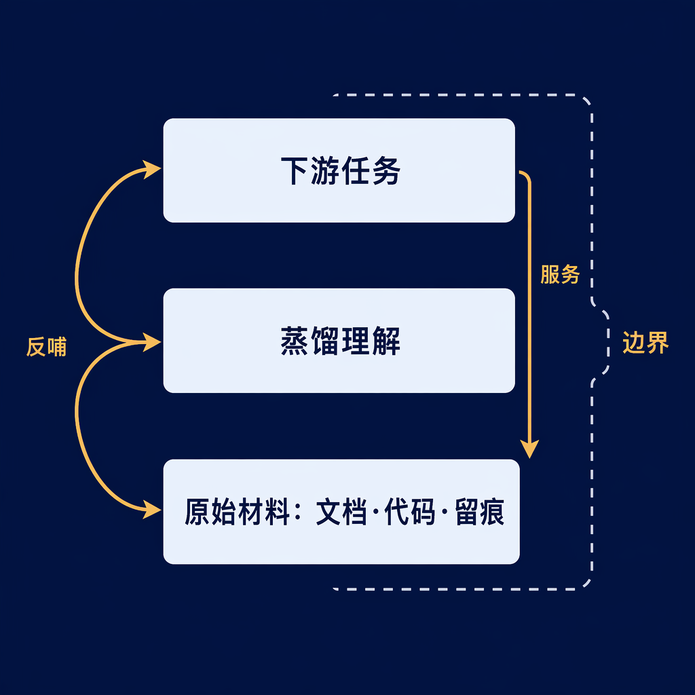
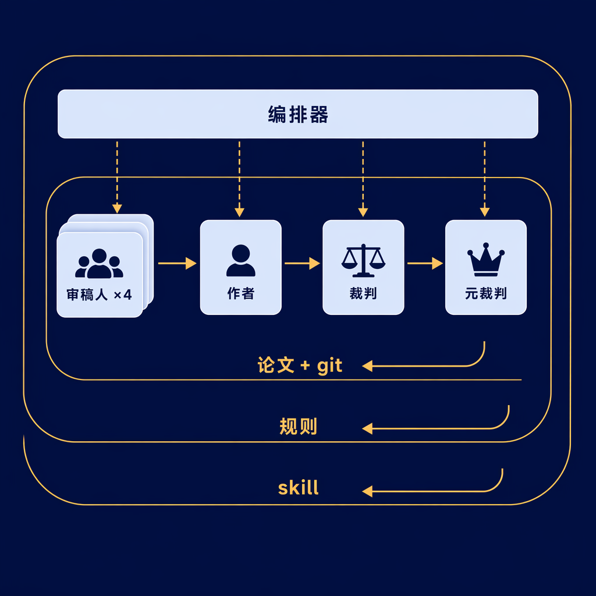

# Agents Don't Lack Generation — They Lack Judgment

#### —— Discover & Crystallize: A Self-Evolving Agent Paradigm

> **Keywords**: AI Agent · Self-Evolution · Judgment / Taste · Dimensions · RL Analogy (SFT / RL) · Eval / Critic · Skill / Workflow / Hook · Knowledge Base · Multi-Agent Adversarial

> **In one sentence**: What makes an evolving system win? Not producing more — but continuously refining friction into judgment, then crystallizing that judgment into reusable assets for the next cycle.

## Introduction: The Bottleneck Has Shifted

We used to compete on who generates more, faster. But generation is no longer scarce — writing docs, producing code, running experiments is nearly free.

The real bottleneck has shifted from *"can you make it?"* to **"can you judge whether it's good?"**

Judgment, when taken apart, is remarkably concrete. At its core lies **dimensions**: how many mutually independent, individually nameable axes of "good vs. bad" you can see in a thing. A person with poor taste has only one axis (okay / not okay). A person with refined taste can decompose a thing into a dozen axes and articulate why each one matters.

But let's be precise: more dimensions doesn't automatically mean better judgment. Judgment is actually the product of three things — how many axes you can name (quantity), how accurately you score on each (calibration), and how well you weigh tradeoffs when axes conflict (weighting). Counting axes without calibrating them or prioritizing among them is no judgment at all. For clarity, the discussion ahead will use "dimensions" as the main thread; calibration and weighting are picked back up in Section 6.

Judgment doesn't grow on its own. A truly evolving system must do two things simultaneously: continuously discover new dimensions from friction, and crystallize those discovered dimensions into something reusable in the next cycle.

> Evolution = Discover dimensions (exploration) + Crystallize dimensions (update). Two strokes cycling to amplify judgment.

This is the single load-bearing structure of the entire piece. Discovery without crystallization means starting from zero every round — friction is wasted. Crystallization without discovery means guarding old dimensions while spinning in place. Only when both strokes are running does the cycle actually turn.

If you take away only three sentences: judgment (eval / critic) should be the highest priority for crystallization, and is also the most frequently overlooked; the higher the layer you crystallize into, the harder it is to undo — gate it with repeated reproduction; you can't skip levels — if you have no judge, don't run a horse race. Feed the judge with free signals first, then bite into the ambiguous. What follows is the full unpacking.

---

## I. It's the Same Kind of Engine as RL

If you've trained models, you'll notice this engine looks a lot like reinforcement learning. Treat it as a strong analogy — don't demand that every gear meshes perfectly. RL's "update" is gradient descent against a scalar reward; an agent's "crystallization" is a human or agent deciding to write a skill. The mechanisms differ. But the analogy does yield testable intuitions.

Start with the two strokes. A model moves forward via two actions: exploration (trying strategies not present in demonstration data) and update (writing good strategies into weights). The two strokes of evolution map directly — discovery is like exploration, crystallization is like updating weights. Without update, even the best discoveries can't be retained.

Now consider where the seed comes from. Here's a chicken-and-egg problem: to mine dimensions from friction, you need some dimensions already in hand just to notice where things feel off. That seed can only come from imitating humans, or from a higher-level paradigm — this is SFT (cold start): behavior cloning from good examples to get you to "can do." But SFT only copies existing dimensions; it doesn't discover new ones. So it's the starting point, not the engine.

Finally, consider where dimensions live. Training a model requires three things: data (world knowledge), a policy (how to act), and a reward model (how to judge). The dimensions accumulated by an evolving system also exist in exactly these three forms:

| Three States of a Dimension | What It Answers | ML Equivalent |
|---|---|---|
| Knowledge (Know-what) | What is it | Data / World Knowledge |
| Skill (Know-how) | How to do it | Policy / Actor |
| Taste (Know-which) | How to judge it | Reward Model / Critic |

These three states aren't three parallel bins — they're three states of the same substance. The same dimension, at different depths of solidification, appears as liquid taste, solid skill, or sedimentary knowledge. Like water, ice, and vapor — don't get hung up on which bucket a given cup "belongs to."

An immediate corollary: every state is crystallized, differing only in depth. And the sediment of one cycle is precisely the seed of the next — this will reappear throughout the discussion of nesting.

This table determines both *what form* crystallization should take, and what the evolutionary ladder looks like.

---

## II. Stroke One: Discover Dimensions

Dimensions are the currency circulating in this engine. This stroke answers a single question: where do new dimensions come from?

The answer is friction. Whenever the system runs, there will be points of awkwardness — those are the entry points for the next dimension. Ranked by signal strength:

> Divergence ＞ Rejection ＞ Stuck ＞ Asking for Help ＞ Surprise ＞ Smooth Success

The further left, the more valuable. A good signal meets one universal criterion: attributability — it can point to *"which step went wrong,"* not just *"the result was bad."* A failure with a diff is far better than a vague "something feels off." Divergence tops the list because, beyond attributability, it adds a further layer: conflict between two independent judges. A dimension invisible to a single judge can be precisely located by the divergence between two.

But there's a frequently overlooked prerequisite: **the gold content of divergence depends on how independent the judges are.** Two homogeneous judges share the same blind spots — their "agreement" may be shared illusion, and their divergence may illuminate nothing real. That's why high-quality divergence often has to be deliberately manufactured — put judges in mutually conflicting stances (expert, layperson, competitor, reproducer), or even swap in different models, forcing out axes that no single perspective can see. Example 3's four-perspective reviewer system is the engineering realization of this principle (see Section 8).

Leaving traces means freeze-storing these awkward points: where the boundary is, how large the gap, which axis it belongs to. The most critical and difficult step is forcing "this feels wrong" into "this is wrong along which specific axis" — interrogating a blob of discomfort until it yields a nameable, reusable judgment axis. Only then is it truly discovered. Stopping at "the result was bad" leaves behind emotion, not a dimension. Tracing is not logging — it's refining friction into raw material for the next step. Friction is ephemeral; if not caught in the moment, that specific awkward point is lost forever.

One more thing: the source of signals shifts with capability. During cold start, the model can't yet handle domain-specific work — friction mostly comes from human feedback. Once it can work independently, friction comes from the various errors it generates on its own. But at every stage, signals never jump out and shout "I'm here" — you need a mechanism to discover, feed back, and crystallize them. Designing this mechanism is itself highly taste-dependent: it determines which friction gets caught and which slips away. This is often the first thing a paradigm loop should build.

Discovery has two modes, determined by signal clarity:

- Ambiguous signal → Force out the dimension: use adversarial setups, horse races, and relentless questioning to force hidden axes onto the table.
- Clear signal → Converge: set standards, run controlled experiments, scale up — quantifying and hardening known axes.

---

## III. Stroke Two: Crystallize Dimensions

A dimension discovered but only alive in this round of conversation evaporates by the next. Crystallization is writing it into some reusable carrier — equivalent to RL writing strategy into weights. This step determines whether evolution is compound interest or Sisyphus.

The simplest justification is cost. Domain work can't function without domain knowledge, but feeding it fresh via prompts and memory in every run is wasteful and accumulates nothing. Crystallize it into a knowledge base, and domain knowledge transforms from a per-run overhead into an asset: crystallized once, recalled repeatedly, and thickened further by downstream feedback. Crystallization isn't decoration — it's the prerequisite for compound interest to begin.

So crystallize into what? The answer is determined by the three states — whichever state a dimension is in, use the corresponding carrier to solidify it:

| This dimension is about… | Crystallize as | ML Equivalent |
|---|---|---|
| How to judge (Taste) | Eval set (quantifiable), critic sub-agent (ambiguous), rubric | Reward fn / Reward Model |
| How to do (Skill) | Skill, workflow, slash command | Policy / Actor |
| What is (Knowledge) | Memory, CLAUDE.md, knowledge base | Data |

Which column a dimension goes into depends on what gap the friction exposed — still the taste/skill/knowledge triad, just seen from the angle of "what's missing." Among these, taste gaps are the rarest and should be prioritized for filling.

These carriers differ not only in hardness but along two orthogonal dimensions: who triggers them (autonomous recall / auto-trigger / manual invocation / orchestrated scheduling), and how much binding force they carry (ignorable reference / semi-structured with embedded judgment / fixed process / hard interception). Different carriers within the same state land at different points on this plane.

The judgment column deserves the most effort, and is also the most easily neglected. A system that claims "judgment is the scarcest resource" yet whose crystallization methods can store knowledge and store skills but uniquely cannot store judgment — in such a system, the most critical state can never compound. You'll re-judge the same good-vs-bad from scratch every time.

It's hard for a structural reason too: RL's reward model is differentiable and can be automatically fattened by gradients; an agent's critic is non-differentiable and can only be iterated by humans or agents round by round. Judgment, as a state, is inherently the hardest to auto-compound — and precisely because it won't grow itself, you must deliberately design crystallization mechanisms for it. The judgment column has two workhorses:

- Eval sets — the crystallization of quantifiable dimensions, corresponding to the reward function. When you discover a quantifiable dimension, the most valuable crystallization is turning it into a repeatable eval. This is the workhorse tool for fattening judgment.
- Critic sub-agents — the crystallization of ambiguous dimensions, corresponding to the reward model. A dedicated sub-agent whose job is to pick faults and assign scores is a packaged, frozen judge, ready to be attached in the next round.

In the skill column, skill and workflow are two parallel forms, not a hierarchy: a skill is a packaged process triggered on scenario match; a workflow is a multi-step orchestration with fixed control flow. The difference lies only in how they're triggered and how rigid their structure is — neither is more "general" than the other (generality is a separate, independent axis; see Section 4). Pick whichever fits the task better, not whichever seems "higher-level."

### A Boundary

Keep "expanding judgment space" separate from "expanding action space." A new tool, a new MCP — these let the system do one more thing, but they don't tell you *"what counts as good."* They expand action space, not judgment space. These are a different class of asset, not dimension crystallization. Mixing them in only blurs the definition: dimension = judgment axis.

---

## IV. Two Loops and the Self-Nesting of Paradigms

After each round, crystallization can land at two levels:

- Artifact loop: the artifact itself gets better — cleaner data, more accurate knowledge base.
- Paradigm loop: the system that produces artifacts gets better — next time, making the same kind of thing is faster and more stable.

To judge whether a round of practice truly "earned its keep," ask one question: besides the artifact improving, did the machine that makes artifacts also improve? If not, the paradigm loop is broken — half the friction was wasted.

So which loop should a given trace feed? One question suffices: will this awkwardness recur in the next similar artifact? One-off goes to the artifact loop — fix this one artifact and move on. Structural and recurring goes to the paradigm loop — retrofit the machine that makes artifacts.

But "recurring" can't be decided on a single guess. Here's an easily overlooked hard rule: **the higher the layer you crystallize into, the higher the entry barrier should be.** Fix one artifact — if wrong, you lose only that one, and it's easy to undo. Modify a general-purpose skill — it acts on all future tasks of that kind. Freeze into a hook — it auto-executes every time, imposing itself with zero judgment. The broader the scope of action and the harder to undo, the more you must gate with repeated reproduction. A "pattern" that appeared only once is likely just noise; only awkwardness that recurs across multiple instances and multiple scenarios qualifies to float up into paradigm or even freeze into law. So the artifact loop can afford bold trial and error; the paradigm loop must be cautious in what it adopts. What enters the paradigm is what has been repeatedly verified, not what just surfaced.

The paradigm loop most needs a special kind of trace — meta-traces: "I manually intervened again" (there's a gap in the workflow), "this step keeps repeating across projects" (time to float it up into a general-purpose skill), "the trace I needed was never even recorded" (the trace-leaving mechanism itself has a gap). The paradigm loop's self-check is also a single question: what did I do manually this time that I'll have to do manually again next time? The answer is the next skill to crystallize.

The paradigm loop self-nests, and nesting is not a new mechanism — it's this very engine eating its own output.

- The same kind of friction repeatedly encountered within a single business task → discover a "business execution dimension" → crystallize into a dedicated carrier serving only that business (often a workflow).
- When you see the same shape of friction across several businesses → this is a higher-level signal → discover a "general dimension" → it floats up, solidifies into a cross-business general-purpose carrier (often a skill / methodology).

So the abstraction "business paradigm → general paradigm" is essentially a carrier floating up along the generality axis: first crystallize into a dedicated carrier bound to a single business, then after being reused in multiple places and the common shape becomes clear, abstract into a cross-business general carrier. What needs to be clear: what floats up is generality (dedicated → general), not some fixed morphological transformation. "A one-off workflow refined into a reusable skill" is just the most common path; a dedicated skill can equally grow into a general-purpose one. Each layer's seed comes from the layer above; at the topmost layer, with no higher layer to rely on, it can only describe itself and seed itself — this is precisely the recursive closure point, and why it's a structural necessity, not decoration.

Here lies the true crux of the recursion: every time you go up a layer, the "artifact" changes, and the dimensions for judging its quality must also change. Judging "whether a data rule is reasonable" uses one set of dimensions; judging "whether the whole knowledge base is well-built" uses another; judging "whether this methodology itself works" uses yet another. Skills and paradigms themselves have quality, and the dimensions for measuring them live in the taste of a still higher layer. So recursion isn't the same set of dimensions applied repeatedly — it's each layer growing its own judgment axes.

> Each loop is nearly self-contained, missing only an external seed; recursion supplies seeds layer by layer, making the whole fractal.

---

## V. A Corollary: The Four-Level Evolutionary Ladder

Lay the three-states table alongside the chicken-and-egg problem, and this paradigm forces out a remarkably specific evolutionary path. It's a falsifiable prediction, not a proven law, but both the logic and the evidence deserve serious consideration.

The logic goes like this: digging out dimensions relies on the critic, and the critic's quality equals the dimensions it has already accumulated. You need dimensions before you can judge, and you need to judge before you can mine new ones — this cycle must break open at a point where the signal is free. Evolution can therefore only climb level by level along the "signal scarcity" gradient:

1. **Pure quantification**: reward is externally given for free (win/loss, right/wrong, pass/fail). No mature critic needed to run — use the free signal to fatten judgment.
2. **Quantitative + ambiguous**: the critic has fattened and can now begin supplying its own signal in areas without external metrics (classic example: RLHF's helpfulness).
3. **Pure ambiguity**: the critic is mature enough to judge in entirely subjective domains (writing, research taste).
4. **Innovation**: a mature critic can finally recognize and reward "value that never existed before." Here a qualitative shift occurs — the first three levels mine dimensions (discovering axes that already existed but were unnamed); the innovation level creates dimensions (inventing value axes that didn't previously exist).

The evidence is AI's own trajectory: first conquering chess / math / code (clear reward), then RLHF (quantitative + ambiguous), and only now beginning to bite into writing and research taste (pure ambiguity), while genuine scientific innovation (creating dimensions) still struggles at the frontier. This sequence doesn't look like coincidence: the critic can only be fattened where the signal is free, and only then, carrying accumulated dimensions, does it bite into scarcer signals.

It yields an extremely practical rule:

> Want to tackle an ambiguous task? First pair it with a quantifiable proxy task, fatten the critic, then turn back to bite into the ambiguity. Running a horse race without a judge only produces a pile of things no one can tell are good or bad.

---

## VI. Three Regulators for the Dimensional System

For the engine to avoid decay over the long run, three regulators are needed:

- **Pruning**: dimensions that only enter and never leave will bloat the system. Axes that haven't meaningfully distinguished good from bad for a long time must be retired promptly. Retirement has two destinations: one, freeze into a hook — becoming a hard constraint that auto-executes every time without any thought ("never commit secrets" was once judgment; now it's interception). Note that this precisely means it's no longer a dimension — judgment is this engine's currency, and a hook is zero judgment, so a hook is the retirement of currency, not its storage. Two, direct pruning — delete an axis that long ago stopped distinguishing good from bad, preventing system bloat. Even more important to guard against: crystallization turning into liability. Solidified skills, rules, and hooks all go stale; old dimensions, if not cleared, will actively steer the system in wrong directions — the thicker the sediment, the heavier the burden. So "crystallization = compound interest" has a precondition: you must be pruning at the same time. Knowing which dimensions to retire is itself a mark of mature taste.

- **Tradeoff weighting**: when dimensions conflict, assign them weights — this is higher-order taste.

- **Self-calibration**: metrics drift away from the dimensions they represent (Goodhart's law). The number an eval outputs can quietly decouple from the taste it was meant to measure, so standards themselves need periodic recalibration.

There's also one judgment that runs throughout: when to stop. Dimension mining has diminishing returns; the timing of the switch from "create" to "harvest" is itself an act of judgment.

---

## VII. The Full Closed Loop

---

## VIII. Three Examples: Taking the Engine Apart

Theory done. Now take it apart through three real projects — a data quality inspection system, a three-layer knowledge base, and a paper debate framework that codes the paradigm itself. The first two may seem unrelated; you'll see they are the upstream and downstream of the same engine. The third, in reverse, verifies the entire structure item by item.

### Example 1 · Data Quality Inspection: A Self-Regenerating Actor-Critic

The task is intent-slot data generation and quality inspection. The difficulty: rule boundaries are inherently fuzzy; there is no ready-made, clear "what counts as correct."

Its solution, taken apart, is exactly an actor-critic pair: one model applies rules to make x→y predictions — this is the actor (policy); another model applies rules to score (x,y) pairs — this is the critic. Both share the same rule set, which is the judgment standard they both consult. The engine thus turns:

| Component | What It Is in the Paradigm |
|---|---|
| Domain knowledge / initial rules | Knowledge-state seed (cold start ≈ SFT) |
| Divergence/rejection between the two models | Friction signal ≈ reward |
| Each individual rule | One dimension (the currency itself, not a "goal") |
| The continuously completed rule set | Dimensions crystallized into the judgment column (rubric = reward model) |
| The workflow running this process | Crystallized into the skill column |

Its most interesting feature: it made the friction signal free and renewable — no reliance on scarce human annotation; every batch of data automatically produces divergence. This is exactly the standard playbook of the ladder's first level: start where the signal is free, use quantified divergence to fatten the critic, then let the fattened critic bite into fuzzier rule boundaries.

Both loops are turning simultaneously: the artifact loop cleans up data and rule sets; the paradigm loop makes "how to build a rule-evolution system" itself more mature.

### Example 2 · Three-Layer Knowledge Base: Dimensions Are the Boundaries

This project has three layers: the bottom layer is raw materials (documents, code, practice traces); the middle layer is business understanding distilled from materials + human knowledge + practice; the top layer is various downstream practices — downstream relies on the knowledge base to go faster and more accurately, while feeding new discoveries back into the base.

Apply the paradigm, and several things that seemed "odd" immediately fall into place:

- The three layers aren't three kinds of things — they're three depths of the knowledge state: raw materials → understanding → living knowledge invoked downstream, with increasing degrees of solidification.
- Dimensions in the knowledge base have no "separate component" — the entire base is the knowledge-state sedimentation of dimensions. It manifests as the knowledge base's boundary: the space of questions it can reliably answer. Downstream tasks getting stuck, answering wrong, having to ask humans — these are gaps exposed at the boundary, and those are the entry points for the next dimension.
- The source of taste signals migrates: early on, it relies on human manual mining ("I feel this part isn't explained thoroughly enough" — humans are expensive seeds, ≈ SFT); later, it relies on downstream stuck-points auto-exposing gaps (free signal, ≈ RL). This is the ladder genuinely walked through in this project.

Crystallization likewise lands in multiple columns: understanding crystallizes into the knowledge column; solidifiable training, evaluation, and analysis workflows crystallize into the skill column, even condensing into a framework skill that lets an agent self-orchestrate experiments, design multi-agent setups, and leave traces of iteration.

### How the Two Examples Nest: Upstream and Downstream of the Same Engine

Looked at individually, each project runs its own engine. Put together, the relationship becomes visible — Example 1 is a downstream of Example 2; it sits inside the knowledge base's "upper-layer practice" slot. Three things then appear, exactly matching the three properties described earlier. The paradigm was abstracted from projects like these — that they align isn't surprising, but how precisely they align says something about whether the abstraction captured what's real:

1. Cross-layer flow. Business understanding in the knowledge base sinks down and becomes the initial rules for the data loop; new rules mined by the data loop float up and solidify back into the knowledge base. One layer's sediment is another layer's seed — this is "every state is crystallized" genuinely relaying across two scales.

2. Joint crystallization, not one-to-one mapping. Running one round of the data loop, a single experience crystallizes simultaneously into four places: cleaner data (artifact) + mature rule framework (business paradigm) + thicker knowledge base (upper layer) + dedicated workflow, after reuse, floating up into a general-purpose carrier (general paradigm). Paradigms don't map one-to-one; the same friction leaves sediment at multiple levels.

3. Same engine, different signal sources. The data loop relies on model divergence; the knowledge base loop relies on downstream stuck-points; and the topmost paradigm loop — this methodology itself right now — relies on "where things felt awkward while doing projects." Signal sources grow fuzzier and scarcer layer by layer, exactly matching the ladder climbing level by level.

And what strings the three layers together is that recursion: judging "whether a data rule is reasonable" requires one set of dimensions; judging "whether the knowledge base is well-built" requires another; judging "whether this methodology itself works" requires yet another set at the next level up. Every time you go up a layer, the "artifact" under scrutiny changes, and the dimensions for judging it grow a new set, living in the taste of a still higher layer.

> So these three layers aren't three different things — they're the same "discover—crystallize" replicated in self-similarity across three scales.

### Example 3 · A Paper Debate Framework: The Entire Engine Written as a Skill

The first two are "business"; this one is "tooling": an adversarial multi-agent paper iteration framework. Its value lies in implementing the entire paradigm as runnable code — every abstract component in the paradigm has a living, breathing corresponding entity here. Item by item:

- Manufacturing friction: the reviewers aren't one but four sub-agents standing on mutually conflicting ground — a strict expert, a lay reader, a competitor, a reproduction auditor — each picking their own kind of fault, and when necessary each can use a different model; the author then responds point by point. Start by using stance differences to manufacture judge independence, then use persona, quota, and burden-of-proof rules to hard-prevent "stance collapse." Reviewers are the critic; the author is the policy; their divergence is the reward. This is exactly Section 2's "deliberately manufacture independent divergence" put into practice, and the extreme version of "signals don't surface themselves — you have to design mechanisms to force them out."
- The two modes are cleanly separated: reviewers' "high-divergence questioning" is forcing out dimensions; the judge's "evidence ＞ logic ＞ subjective" is convergence.
- Three-layer crystallization seen in a single pass: changes land in the paper + git (artifact loop); the meta-judge evolves debate rules each round (single-session paradigm loop); after the debate ends, general lessons float up and rewrite the skill itself (cross-session paradigm loop). Lower-layer crystallizes into per-session rules; only after being verified as general does it float up into the skill — carrier floating up in action.
- Trace routing is hard-coded as a routing rule: general lessons (originating from LLM common ills or universal writing patterns) float up into the skill; local lessons stay in the paper directory. This is "recurring → paradigm loop, one-off → artifact loop" implemented in code.
- Self-calibration: when the author's concession rate gets too high, trigger an "excessive-concession re-review" — precisely preventing the "adversarial intensity" metric from being gamed upward by collapse (Goodhart).

> Three projects originally unrelated to each other, landing on the same set of discover—crystallize components. This isn't independent proof — the paradigm was distilled from practices like these — but the fact that the same structure repeatedly aligns across three scales shows it's capturing something genuinely shared beneath the surface of these systems.

---

## Conclusion: What Accumulates, and What Gets Consumed

One sentence to tie it together: generation is now free; the only thing left that can compound is judgment — and judgment only grows when you both discover it and crystallize it.

Unpacked into five:

- **Measure work not by output count, but by dimensions**: can you name one more articulate axis of good vs. bad? But don't just count axes — also check whether you score them accurately and know which ones matter more when they clash.
- **The engine has only two strokes: discover, and crystallize.** Too little discovery and you spin in place; too little crystallization and every round resets to zero.
- **What most deserves crystallization is judgment itself**: evals and critics — not knowledge, not skills. This state is the scarcest and the most often overlooked.
- **The same engine runs at every scale**: improving artifacts, improving the system that produces artifacts, improving the method by which you iterate your methods. The higher you go, the broader the impact and the harder to undo — gate the entry higher, using repeated reproduction as your check.
- **You can't skip levels**: no judge, no horse race. Feed the judge with free signals first, then bite into the ambiguous.

At bottom, most people optimize artifacts; a few optimize the machine that produces artifacts; very few optimize *"their own capacity to become stronger."* What creates the gap is never who works harder — it's who refines every instance of friction into judgment that can stay — because **throughput gets consumed; judgment accumulates.**

---

Finally, let's return to the opening analogy. This document has been using RL as a lens to understand agents — but the arrow can also be reversed: can RL's own training pipeline run discover—crystallize?

Currently, RL's exploration and update happen at the same layer: the policy explores new strategies, the reward model scores them, gradients update weights — changing the strategy for *this* task, not automatically changing the method for *next* training. But if we treat RL's training loop as the "artifact loop," then it deserves a paradigm loop too: can hyperparameter search strategies themselves improve? Can the workflow for designing reward models be crystallized into reusable patterns? Can traces of training failures force out new debugging dimensions, then freeze into next round's defaults?

The bottleneck for RL paradigm evolution isn't the exploration space — AutoML, NAS, and learned optimizers have already proven we can find better training methods. The bottleneck is in the judgment column: what do you use to judge that "one training methodology is better than another"? That meta-critic is almost entirely human-supplied today. And the thesis of this document holds here equally: for the paradigm loop to start turning, judgment must first be able to accumulate, rather than being redesigned from scratch every round.

This is an open question. But one thing is certain — the path to paradigm evolution lies not in generating more candidates, but in crystallizing judgment.
